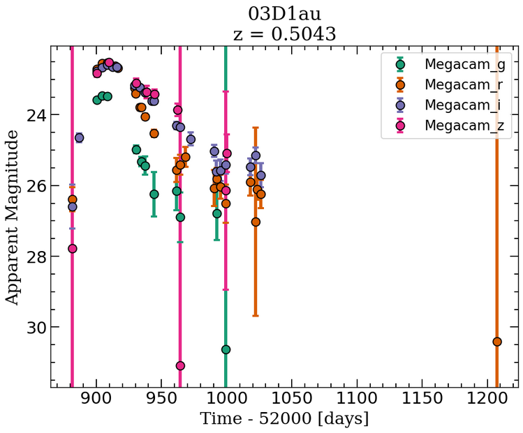
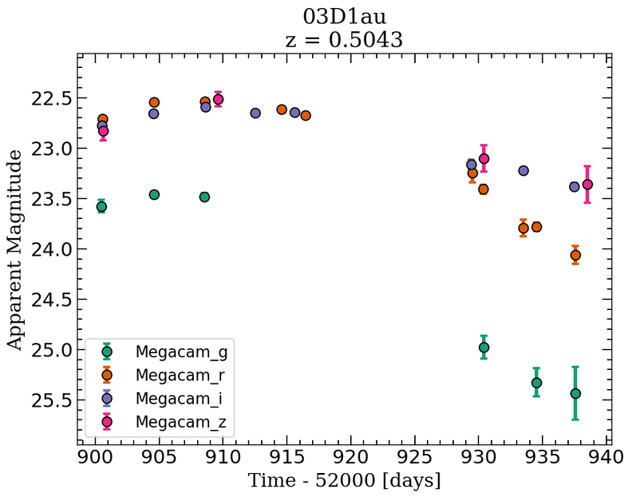
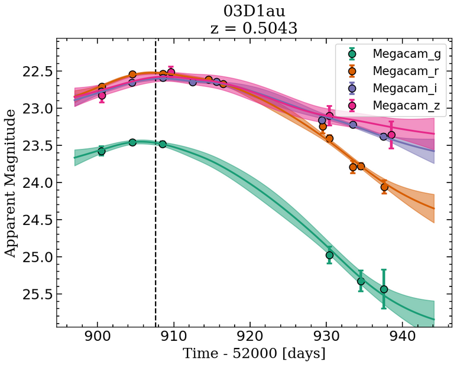
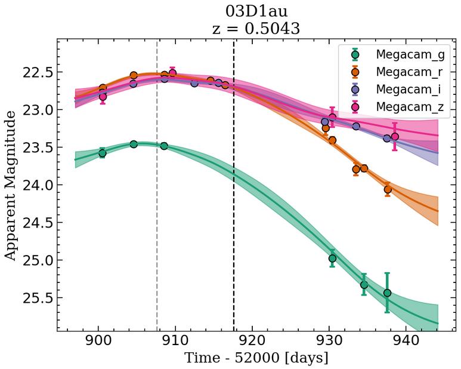
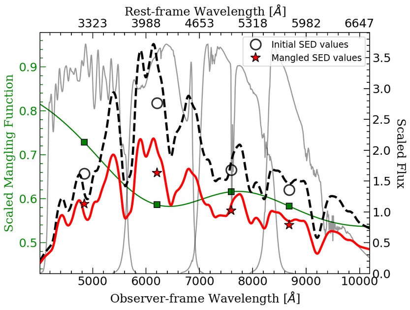
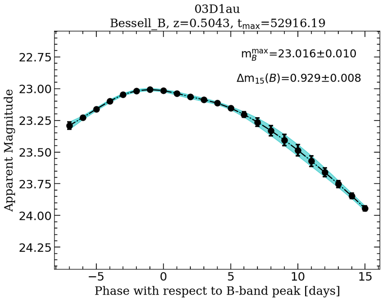
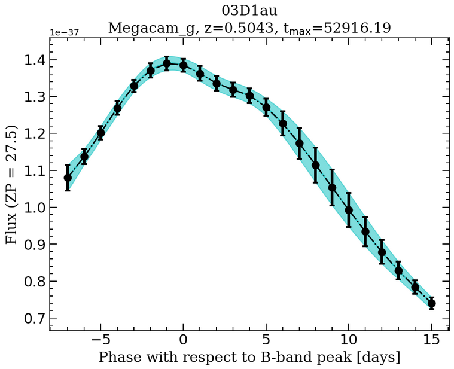

.. _advancedexamples:

Advanced Example
========================

Exploring fitting parameters
############################

In here we will see in more detail the different functionality PISCOLA incorporates. As a reminder, PISCOLA looks for the supernova file in the directory called :code:`data` under the working directory. Always remember to use :code:`sn.normalize_data()` so PISCOLA converts all fluxes to physical units. This line is run explicitly so the user can understand what the code is doing "under the hood". We can plot the data in magnitude or flux space:

.. code:: python

	import piscola

	sn = piscola.call_sn('03D1au', directory='data') 

	sn.normalize_data()
	sn.plot_data(plot_type='mag')

Let's mask the data. We can chose to keep the data with a signal-to-noise (S/N) of at least 3. We can also mask the data in phase space. As we haven't estimated the B-band peak yet, PISCOLA takes the maximum flux of the *pivot* band (the one closest to rest-frame B-band) as the peak and estimates the phases from there:

.. code:: python
	
	sn.mask_data(snr=3, mask_phase=True, min_phase=-10, max_phase=20)
	sn.plot_data(plot_type='mag')

The data looks much nicer now. We can fit the light-curves with Gaussian Process using different kernels for the time (:code:`kernel`) and wavelength :code:`kernel2` axes. We can also choose to plot the fitted light curves together or separately:

.. code:: python
	
	sn.fit_lcs(kernel='matern32', kernel2='squaredexp')
	sn.plot_fits(plot_together=True, plot_type='mag')

The vertical dashed line marks the inital estimation of the B-band peak from the fits. This is stored under the :code:`sn.tmax0` and :code:`sn.tmax` variables:

.. code:: python

	print(sn.tmax0, sn.tmax)

.. code:: python

	52907.6 52907.6

The difference between both is that :code:`sn.tmax` can later changes as the estimation of the B-band peak can get refined (see further below). Let's see what happens if we manually change :code:`sn.tmax`:

.. code:: python
	
	sn.tmax += 10
	sn.plot_fits(plot_together=True, plot_type='mag')

Now the grey line marks the inital estimation of the B-band peak (:code:`sn.tmax0`), while the black line marks the "refined" value (:code:`sn.tmax`). Let's mangle our SED template so PISCOLA can apply *K*-correction (for more details about this process you can check `Hsiao et al. 2007 <https://ui.adsabs.harvard.edu/abs/2007ApJ...663.1187H/abstract>`_), were the code also corrects for Milky Way (MW) extinction (PISCOLA does not correct for any other sources of dust):

.. code:: python
	
	sn.mangle_sed(min_phase=-8, max_phase=15, kernel='matern52', scaling=1.0, reddening_law='ccm89')
	sn.plot_mangling_function(0)

.. code:: python

	Mangling results, i.e., difference between mangled SED and "observed" magnitudes, at phase 0:
	Megacam_g: 0.0000 [mags]
	Megacam_r: 0.0000 [mags]
	Megacam_i: 0.0000 [mags]
	Megacam_z: -0.0000 [mags]

With PISCOLA one can choose the phase range to use, the kernel for the mangling function, the MW dust maps (:code:`1.0` for Schlegel, Fikbeiner & Davis 1998), and reddening law (:code:`ccm89` for Cardelli, Clayton & Mathis 1989). PISCOLA looks by default under the ``src/piscola/sfddata-master`` directory for the dust maps (``fits`` files), but this can be changed with the ``dustmaps_dir`` argument in the :func:`sn.mangle_sed()` function. There are different combinations one can try here, but the default values are usually enough. The :func:`sn.plot_mangling_function()` function by default prints the difference in magnitudes between the observations and mangled (colour-matched) SED template. In principle, the closer the values are to zero, the better.

Let's proceed calculating the rest-frame light curves and the parameters. The :func:`sn.calculate_lc_params()` function does this. The peak is calculated again from the reconstructed rest-frame B-band light curve (this "refined" value is saved under :code:`sn.tmax`). If this is too far from the inital estimation (meaning that the initial estimation was poor), the the whole process is automatically repeated until convergence is reached or until the maximum number of iterations is reached (:code:`sn.tmax` is updated with each iteration). For the sake of time, we will set :code:`maxiter = 1`:

.. code:: python
	
	sn.calculate_lc_params(maxiter=1)
	sn.display_results('Bessell_B', display_params=True)

The results can be displayed together with the light-curve parameters. The results don't look great, but this is because of the choices we took above (this example is just suppose to show the functionality of PISCOLA). If one of the parameters cannot be calculated (due to data coverage - one of the limitations of PISCOLA), this is not displayed. We can check which rest-frame light curves PISCOLA was able to reconstruct:

.. code:: python

	sn.corrected_lcs.keys()

.. code:: python

	dict_keys(['Megacam_g', 'Bessell_B', 'Bessell_U'])

This means that we can also plot the rest-frame :code:`Megacam_g` filter (in flux space this time):

.. code:: python
	
	sn.display_results('Megacam_g', plot_type='flux')

Finally, you can access the light curve parameters which are stored in a dictionary:

.. code:: python

	sn.lc_parameters.keys()

.. code:: python

	dict_keys(['mb', 'mb_err', 'dm15', 'dm15_err', 'colour', 'colour_err'])

Saving and loading a supernova object
#####################################

Once you are done fitting a supernova you can save the object in a `pickle <https://docs.python.org/3/library/pickle.html>`_ file so you can access it later:

.. code:: python

	sn.save_sn()

This will save the object with the supernova name (``<sn_name>.pisco`` -- a pickle file using the ``.pisco`` extension), or you can give it a different name if desired. This object can be loaded via:

.. code:: python

	sn = piscola.load_sn(<sn_name>)

As can be seen, PISCOLA has a lot to offer, but let me know if you want to contribute in any way!
