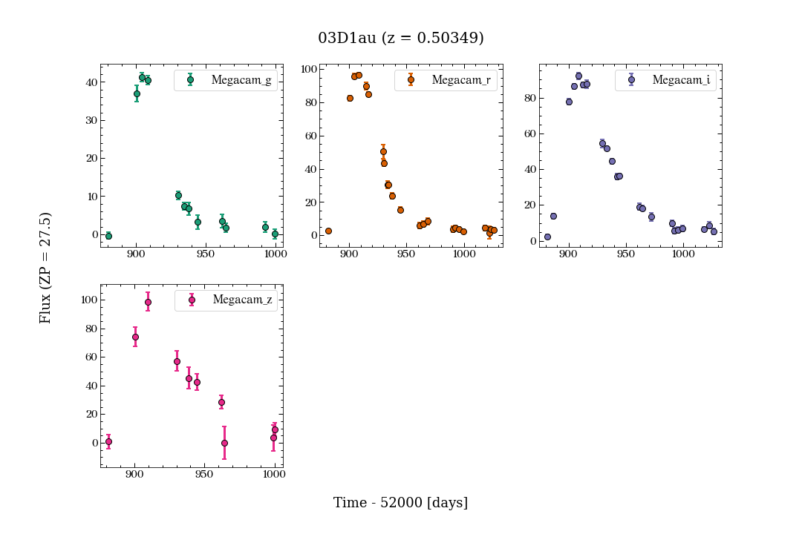
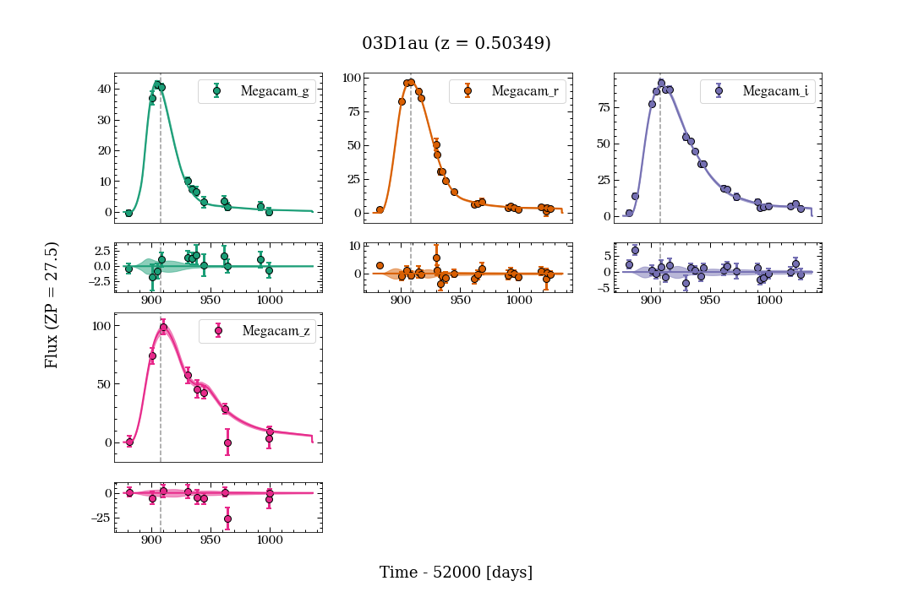
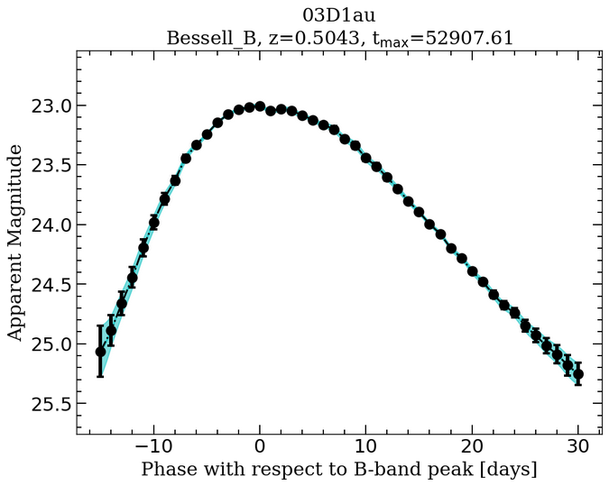

.. _basicexamples:

Basic Example
========================

Simple usage
~~~~~~~~~~~~~~~~~~~~~~~~~~~~~~~

In here we show how to use PISCOLA in the simplest way possible. You can run this example on google colab: |Open In Colab|

.. |Open In Colab| image:: https://colab.research.google.com/assets/colab-badge.svg
   :target: https://colab.research.google.com/drive/1Tjel0cXtHxMOKjem0a-9iZzGJhTD-Oz8?usp=sharing

As always, we start by importing the necessary packages.

.. code:: python

	import piscola

PISCOLA uses its own format for a SN file (explained in the advanced implementation below) which is similar to the one used by other light-curve fitting codes. As an example we have SN ``03D1au`` (from the SNLS survey) in a file called ``03D1au.dat`` inside the ``data/`` directory. This file can be downloaded from the `repository <https://github.com/temuller/piscola/tree/master/data>`_ directly or with the command ``wget https://raw.githubusercontent.com/temuller/piscola/master/data/03D1au.dat`` on a terminal. To import a SN all you need to do is use the :func:`call_sn()` function which receives two arguments, the SN name (or file name) and the directory where to find the file (``data/`` by default).

.. code:: python

	sn = piscola.call_sn('03D1au')
	print(sn)
	print(f'Observed bands: {sn.bands}')

.. code:: python

	name = 03D1au, z = 0.50349, ra = 36.043209, dec = -4.0374690000000015
	Observed bands: ['Megacam_g', 'Megacam_r', 'Megacam_i', 'Megacam_z']

The ``sn`` object will contain the SN information, i.e., name, redshift, RA, DEC and light curves. The latter are found in ``sn.data``, a dictionary with the observed bands as **keys**, including the zero-point (``zp``), and magnitude system (``mag_sys``). **Note that PISCOLA accepts fluxes as input, not magnitudes**.

.. code:: python

	print(sn.data.keys())
	print(sn.data['Megacam_g'].keys())

.. code:: python

	dict_keys(['Megacam_g', 'Megacam_r', 'Megacam_i', 'Megacam_z'])
	dict_keys(['time', 'flux', 'flux_err', 'zp', 'mag_sys'])

We need to **normalize** the data so the flux is converted to physical units if it is not already in those units. We can also mask the data according to the signal-to-noise ratio (``S/N > 5``, by default) and/or phases wanted by using :func:`sn.mask_data()`. The latter is not done by default when calling the function. The light curves can be plotted by calling :func:`sn.plot_data()`.

.. code:: python

	sn.normalize_data()
	sn.mask_data()
	sn.plot_data()

To fit the light curves one needs to use :func:`sn.fit_lcs()`, where the user can decide which kernel to use (``matern52`` by default). One can also plot the fits afterwards by using ``sn.plot_fits()``. From the light curve fits you will get an initial estimation of the rest-frame B-band peak (plotted as a vertical black dashed line).

.. code:: python

	sn.fit_lcs()
	sn.plot_fits()

	print('Initial B-band peak estimation:', sn.tmax0)

.. code:: python

	Initial B-band peak estimation: 52907.8

The next step is not find the *mangling function* which will warp the SED template to match the SN colours at the given epochs. This is done by using :func:`sn.mangle_sed()` and giving the minimum and maximum phase with respect to B-band peak estimated in the previous step (``-15`` and ``+30`` days by deaulft, respectively). The kernel used can also be chosen (``squaredexp`` by default). This process can take up to several minutes depending on several factors, but it usually takes about two minute. This is very slow compared to template-based fits, but the end product is worth it!

.. code:: python

	sn.mangle_sed()

Extinction correction is calculated internally as part of the mangling process. Next comes the estimation of the light-curves parameters for which we use :func:`sn.calculate_lc_params()`. This step can also take a while to run as it compares the final estimation of the B-band peak with the initial one. If their difference is larger than a certain *threshold* (specified in the code), the whole mangling process is repeated (internally) until convergence is reached.

.. code:: python

	sn.calculate_lc_params()

Finally, we can check the estimated light-curves parameters and plot the rest-frame B-band or any other band (restricted by the data coverage).

.. code:: python
	
	sn.display_results()
	print(f't_peak = {sn.tmax} +/- {sn.tmax_err}')
	print(sn.lc_parameters)

.. code:: python
	
	t_peak = 52907.61 +/- 0.12
	{'mb': 23.01570005610094, 'mb_err': 0.009595737298040906, 'dm15': 0.9289279683676384, 'dm15_err': 0.007616849936084865, 'colour': nan, 'colour_err': nan}

where the ``nan`` values are shown because the data coverage is not enough to estimate colour.

Putting it all together
~~~~~~~~~~~~~~~~~~~~~~~~~~~~~~~

.. code:: python

	sn = piscola.call_sn('03D1au')

	sn.normalize_data()
	sn.fit_lcs()
	sn.mangle_sed()
	sn.calculate_lc_params()

Or, if you just want to fit using the default values, you can use :func:`sn.do_magic()`.

.. code:: python

	sn = piscola.call_sn('03D1au')
	sn.do_magic()

