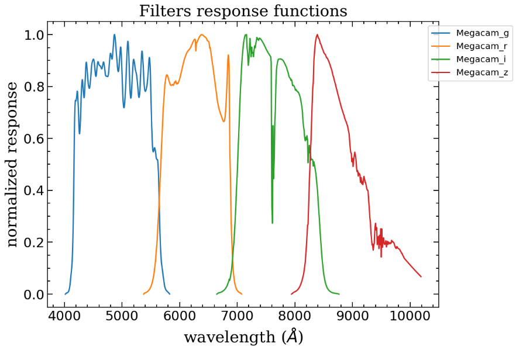

.. _furtherdetails:

Further details: filters, magnitude systems and SED templates
===============================================================

Let's see what else PISCOLA has to offer. This is probably aimed towards more advanced user.

Filters
########################

With PISCOLA you can easily plot the filters of the observed bands to inspect them:

.. code:: python

	import piscola

	sn = piscola.call_sn('03D1au')   
	sn.plot_filters()

Let's check the filters we currently have in our :code:`sn` object. Remember that all *Bessell* filters are initially imported by default:

.. code:: python

	sn.filters.keys()

.. code:: python

	dict_keys(['Megacam_g', 'Megacam_i', 'Megacam_r', 'Megacam_z', 'Bessell_B', 'Bessell_I', 'Bessell_R', 'Bessell_U', 'Bessell_V'])

One can easily add other filters:

.. code:: python

	sn.add_filters(['sdss_g', 'sdss_r'])
	sn.filters.keys()

.. code:: python

	dict_keys(['Megacam_g', 'Megacam_i', 'Megacam_r', 'Megacam_z', 'Bessell_B', 'Bessell_I', 'Bessell_R', 'Bessell_U', 'Bessell_V', 'sdss_g', 'sdss_r'])

Or delete some of the observed bands:

.. code:: python

	sn.delete_bands(['Megacam_g'])
	sn.plot_filters()

.. image:: further_details/filters2.png

Adding filters not included in PISCOLA
**************************************

To add filters which are not included with the code one must add them under the :code:`piscola/filters` directory, preferably in a new directory. The filter will get the name from the file name. For example, we can create a file with the name :code:`New_g.dat`. PISCOLA will then assume that the name of the filter is :code:`New_g`. The :code:`.dat` extension is required. The file must contain two columns: wavelength in angstroms in the first column, and tranmission in the second one.

Magnitude systems
########################

Magnitude systems are stored under the :code:`piscola/standards` directory, where you will find the files for standard stars commonly used (e.g., :code:`alpha_lyr_stis_005.dat`, :code:`bd_17d4708_stisnic_005.dat`), among other files. The :code:`magnitude_systems.txt` file contains the names of the magnitude systems and the files which contain the zero-points of those magnitude systems. For example:

.. parsed-literal::

	#magnitude_system  file
	AB		ab_sys_zps.dat
	BD17		bd17_sys_zps.dat
	AB_B12		ab_b12_sys_zps.dat
	AB_SDSS		ab_sdss_sys_zps.dat
	BD17_JLA 	bd17_jla_sys_zps.dat
	BD17_SNLS3 	bd17_snls3_sys_zps.dat
	BD17_SWOPE	bd17_swope_sys_zps.dat

These files must contain a line which tells PISCOLA which standard SED to use and the zero-point for each filter. For example:

.. parsed-literal::

	standard_sed: bd_17d4708_stisnic_003.dat

	# Magnitudes in the Landolt system : Landolt & Uomoto (2007)
	STANDARD_U 9.724
	STANDARD_B 9.907
	STANDARD_V 9.464
	STANDARD_R 9.166
	STANDARD_I 8.846

If you want to add another magnitude system, just follow the same structure.

SED template
########################

Let's check the SED that PISCOLA uses:

.. code:: python

	print('SED name:', sn.sed['name'])
	print('SED data:', sn.sed['data'].columns.values)

.. code:: python

	SED name: jla
	SED data: ['phase' 'wave' 'flux']

Have in mind that :code:`sn.sed['data']` is a `pandas <https://pandas.pydata.org/>`_ *DataFrame*. There are other SED versions available as well:

.. code:: python

	sn.print_sed_templates()

.. code:: python
	
	List of available SED templates: ['conley09f', 'guy07', 'jla']

One can also change the version being used:

.. code:: python

	sn.set_sed_template('guy07')
	print('SED name:', sn.sed['name'])

.. code:: python

	SED name: guy07

Adding SED templates not included in PISCOLA
********************************************

SEDs are stored under the :code:`piscola/templates` directory, in their own respective directories. PISCOLA reads the file :code:`snflux_1a.dat` to import a template, where the first column of the file are the phases, the second one are the wavelengths, and the last one are the fluxes. If you want to add another template, just follow the same structure.
