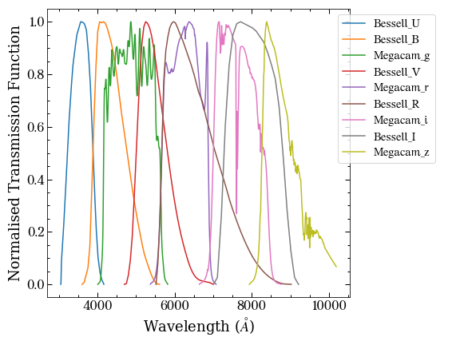

.. _fi_filters:

Filters
=======

Filters are defined by their own classes in PISCOLA: :class:`SingleFilter` and :class:`MultiFilters`.

SingleFilter
############

This class represents a single filter and can be called in the following way:

.. code:: python

	from piscola.filters_class import SingleFilter

	filt = SingleFilter('Bessell_B')
	print(filt)
	
.. code:: python

	name: Bessell_B, eff_wave: 4421.6 Å, response_type: photon

The name of the filter must match one of the available ones in the ``filters`` directory in PISCOLA. Each filter will contain information about its wavelength range, transmission function, etc:

	
.. code:: python

	filt.__dict__
	
.. code:: python
	
	{'name': 'Bessell_B',
	 'filt_file': '/path/to/piscola/filters/Bessell/Bessell_B.dat',
	 'wave': array([3605., 3610., 3615., 3620., 3625., 3630., 3635., 3640., 3645.,
		3650., 3655., 3660., 3665., 3670., 3675., 3680., 3685., 3690.,
		3695., 3700., 3705., 3710., 3715., 3720., 3725., 3730., 3735.,
		...
		5540., 5545., 5550., 5555., 5560., 5565., 5570., 5575., 5580.,
		5585., 5590., 5595., 5600., 5605., 5610.]),
	 'transmission': array([0.00000e+00, 1.98629e-04, 8.56342e-04, 1.51406e-03, 2.17177e-03,
		2.82948e-03, 3.48719e-03, 4.14491e-03, 4.80262e-03, 5.46033e-03,
		6.11805e-03, 7.40083e-03, 1.01283e-02, 1.28558e-02, 1.55832e-02,
		...
		5.89171e-04, 4.85735e-04, 3.82299e-04, 2.78863e-04, 1.75427e-04,
		7.19915e-05, 0.00000e+00]),
	 'response_type': 'photon',
	 'eff_wave': 4421.611517501659,
	 'comments': ''}
	
The ``response_type`` has to be either ``photon`` or ``energy`` (most have the former).	If a ``README.txt`` file is found in the filter's directory (``Bessell/`` in this case), it is added to the ``comments``. For information about the available functions, check the :ref:`Filters Class <filters>`.

MultiFilters
############

This is a class that wraps the single filters into a single class:

.. code:: python

	from piscola.filters_class import MultiFilters 

	filters = MultiFilters()
	filters.__dict__
	
.. code:: python

	{'bands': ['Bessell_U', 'Bessell_B', 'Bessell_V', 'Bessell_R', 'Bessell_I'],
	 'Bessell_U': name: Bessell_U, eff_wave: 3575.6 Å, response_type: photon,
	 'Bessell_B': name: Bessell_B, eff_wave: 4421.6 Å, response_type: photon,
	 'Bessell_V': name: Bessell_V, eff_wave: 5515.1 Å, response_type: photon,
	 'Bessell_R': name: Bessell_R, eff_wave: 6605.5 Å, response_type: photon,
	 'Bessell_I': name: Bessell_I, eff_wave: 8071.3 Å, response_type: photon}
	 
By default, the `Bessell` filters are always included as these are the ones traditionally used for cosmology (e.g. for colour :math:`(B-V)`). However one can also call the :class:`MultiFilters` class with other filters:

.. code:: python

	bands = ['Megacam_g', 'Megacam_r', 'Megacam_i', 'Megacam_z']
	filters = MultiFilters(bands)
	print(filters.bands)
	filters.plot_filters()

.. code:: python

	['Megacam_g', 'Megacam_r', 'Megacam_i', 'Megacam_z', 'Bessell_U', 'Bessell_B', 'Bessell_V', 'Bessell_R', 'Bessell_I']	
	

For information about the available functions, check the :ref:`Filters Class <filters>`.

Adding New Filter Files
#######################

To add filters which are not included in PISCOLA one must add them under the :code:`filters` directory, preferably on a separate sub-directory. The filter will get the name from the file name. For example, we can create a file with the name :code:`New_g.dat`. PISCOLA will then assume that the name of the filter is :code:`New_g`. The :code:`.dat` extension is required. The file must contain two columns: wavelength in `angstroms` in the first column, and tranmission in the second one.

